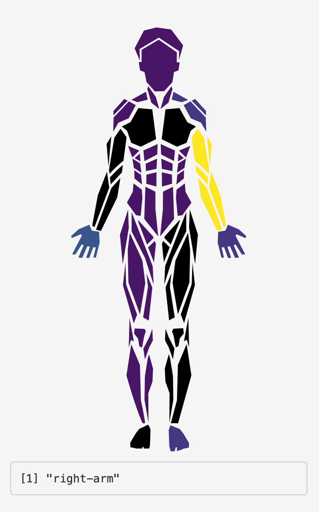

# shinyBody

A simple human body SVG using CSS and HTML, turned into a shiny input

<!-- badges: start -->
<!-- badges: end -->

A custom Shiny input widget that lets you select a body part and will return that body part's name.
You can also color limbs based on data.

## What is human body syg?
Create a human body svg and catch data with svg properties.
[Live Demo](https://maya-gans.shinyapps.io/human_body_app/)
