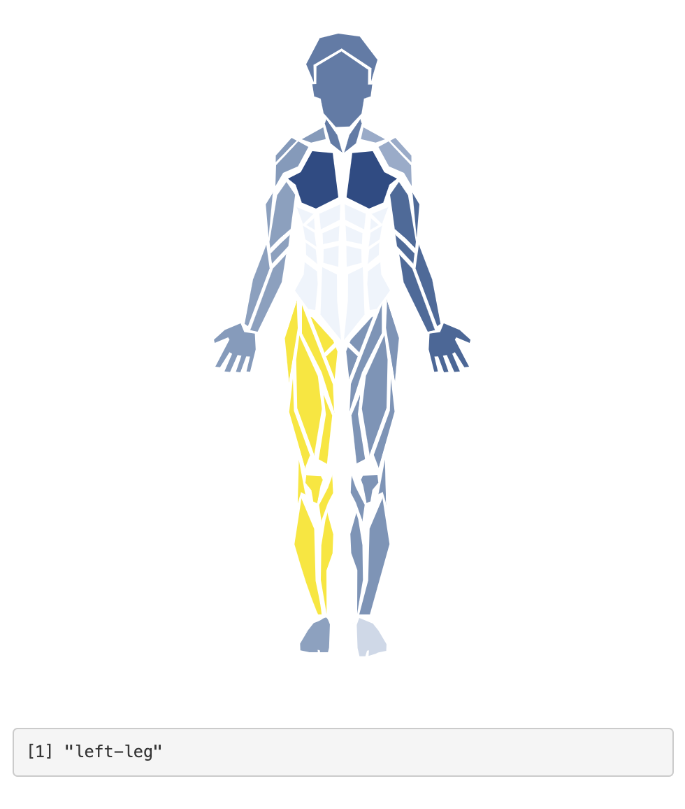

# shinyBody

<!-- badges: start -->
<!-- badges: end -->

A custom Shiny input widget built with HTML and CSS that lets you select a body part and will return that body part's name.
You can also color limbs based on data.

